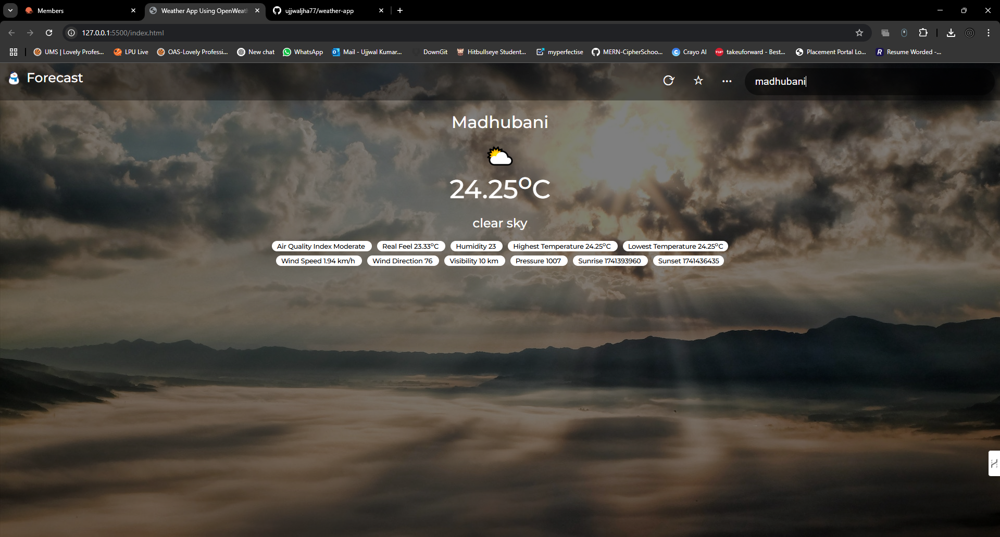

# 🌦️ Weather App using OpenWeatherMap API 🌍

## 📜 Description

This is a simple **Weather App** built using **Vanilla JavaScript** and the **OpenWeatherMap API**. It fetches real-time weather data and displays various details like 🌡️ **temperature**, 💧 **humidity**, 💨 **wind speed**, 🌫️ **air quality**, and more.

---

## ✨ Features

✔️ Fetches **live weather data** using OpenWeatherMap API
✔️ Displays:
   - 🌡️ **Current Temperature**
   - 🌍 **Air Quality Index**
   - 🌡️ **Real Feel**
   - 💧 **Humidity**
   - 📈 **Highest & Lowest Temperatures**
   - 💨 **Wind Speed & Direction**
   - 🌫️ **Visibility & Pressure**
   - 🌅 **Sunrise & Sunset Times**
✔️ **User-friendly interface** with dynamic updates

---

## 🚀 Installation & Setup

### 1️⃣ Clone or Download the Repository

- Clone the repo using Git:
  ```sh
  git clone https://github.com/ujjwaljha77/weather-app.git
  ```
- Or **download and extract** the ZIP file.

### 2️⃣ Open the Project in VS Code

- Open **VS Code**
- Click **File** → **Open Folder** → Select the **weather-app** folder

### 3️⃣ Get OpenWeatherMap API Key

- Visit [🔗 OpenWeatherMap](https://openweathermap.org/)
- **Sign up/Login**
- Go to **API Keys** and generate a new API key

### 4️⃣ Add API Key to `script.js`

- Open `script.js`
- Locate the following line:
  ```js
  const API_KEY = 'YOUR_API_KEY';
  ```
- Replace `'YOUR_API_KEY'` with your actual API key 🔑

### 5️⃣ Run the App

#### ▶️ Method 1: Using Live Server (Recommended)

- Install **Live Server** extension in VS Code
- Right-click **index.html** → Click **Open with Live Server**

#### 🏃 Method 2: Manual Opening

- Open the project folder
- **Double-click `index.html`** → Open in **Chrome/Firefox/Edge**

---

## 📸 Screenshots




---

## 🛠️ Technologies Used

- **📄 HTML** – Structure of the app
- **🎨 CSS** – Styling and layout
- **⚡ JavaScript** – Fetching and displaying weather data
- **🌍 OpenWeatherMap API** – Source of weather data

---

## 📝 License

This project is licensed under the **MIT License**.

---

## 👨‍💻 Author

Developed by **Ujjwal Jha**. ✨

---

🌤️ **Enjoy using the Weather App!** 🌎

